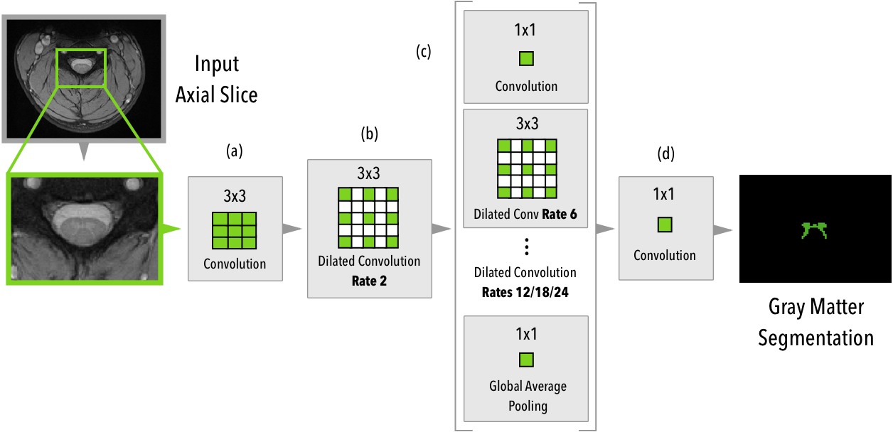
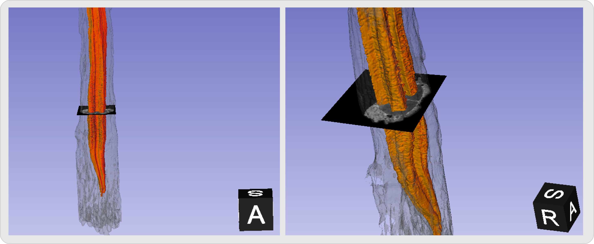

# Spinal cord gray matter segmentation using deep dilated convolutions

This repository contains the source-code for the paper "Spinal cord gray matter segmentation using deep dilated convolutions",
available as [pre-print on ArXiv](https://arxiv.org/abs/1710.01269).

# Requirements Installation

To use this repository, you'll need to install the following requirements:

* Clone the repository
* Install Python requirements with `pip install -r pip-requirements.txt`
* Open the Jupyter Notebook located at `notebooks` folder

# Remarks
Some remarks regarding the model:

* This model was trained on a common space with a voxel size of 0.25mm x 0.25mm, so 
  you'll have to resample your data to this space if you want good results;
* This repository contains the model trained on the GM Challenge Dataset (both train and validation),
  the model is located on the directory called `models` together with a json file containing
  the mean/std that was used to standardize the training data;
* For the training procedure, please see the original paper for more information;

## Citation
If you use this work in your research, please cite:

    @article{arxiv1710.01269,
      author = {Christian S. Perone, Evan Calabrese, Julien Cohen-Adad},
      title = {Spinal cord gray matter segmentation using deep dilated convolutions},
      journal = {arXiv preprint arXiv:1710.01269},
      year = {2017}
    }
